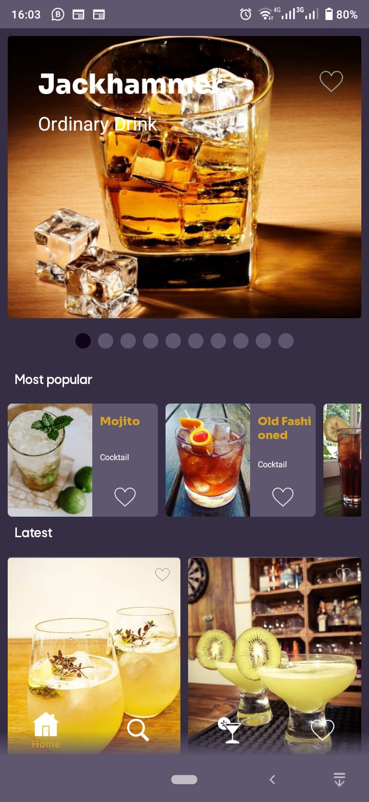
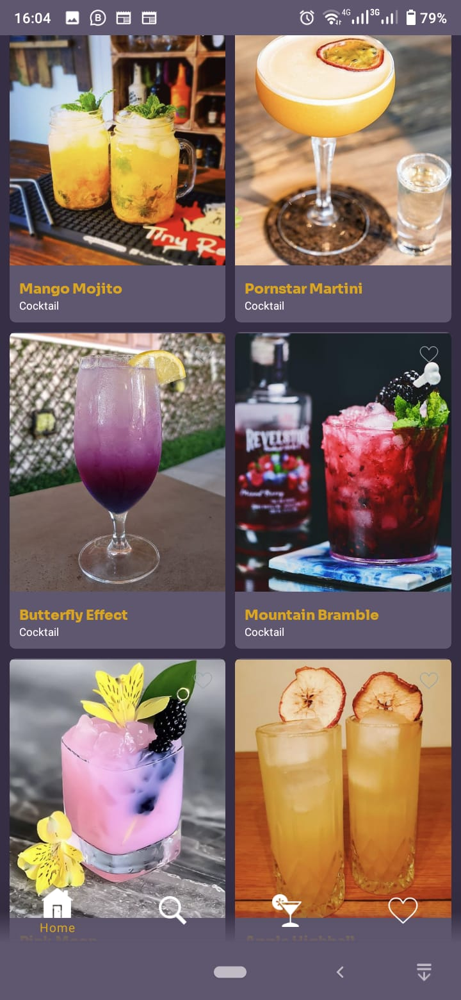
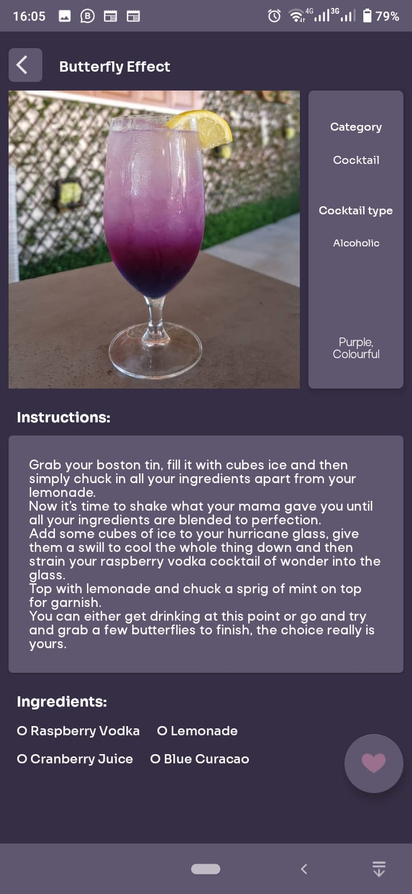
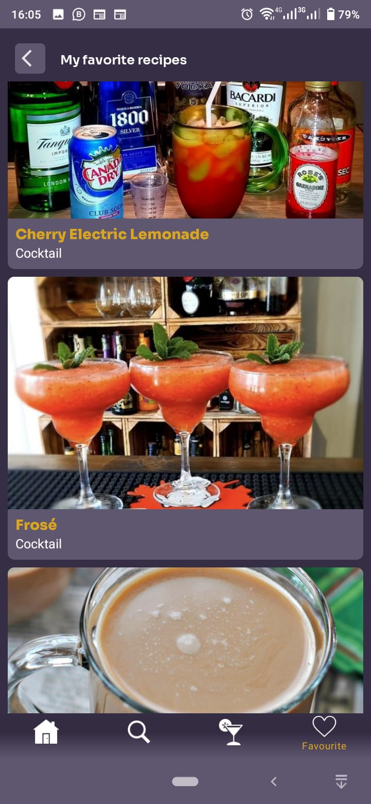

# Cock-tail World

This app consumes The Cock-tail DB cocktail recipes using Retrofit.

Build System : [Gradle](https://gradle.org/)

## Table of Contents

- [App](#app)
- [Architecture](#architecture)
- [Libraries](#libraries)
- [Demo](#demo)

## App
TO DO

## Architecture

The app follows MVVM, the recommended architecture pattern. MVVM allows for the separation of concern which is a major principle that app architecture designs should follow:-[more](https://developer.android.com/jetpack/guide#separation-of-concerns)

## Testing

TO DO
 
## Libraries

Libraries used in the whole application are:

- [Jetpack](https://developer.android.com/jetpack)🚀
  - [Viewmodel](https://developer.android.com/topic/libraries/architecture/viewmodel) - Manage UI related data in a lifecycle conscious way
  - [View Binding](https://developer.android.com/topic/libraries/view-binding) - recommended library that replaces findViewById()
  - [Room](https://developer.android.com/training/data-storage/room) - It's a persistence library that provides an abstraction layer over SQLite to allow fluent database access while harnessing the full power of SQLite.
- [Retrofit](https://square.github.io/retrofit/) - Type-safe HTTP client and supports coroutines out of the box.  Used for the network calls.
- [Gson](https://github.com/google/gson) - Used to convert JSON to Java/Kotlin classes for the Retrofit
- [okhttp-logging-interceptor](https://github.com/square/okhttp/blob/master/okhttp-logging-interceptor/README.md) - logs HTTP request and response data.
- [kotlinx.coroutines](https://github.com/Kotlin/kotlinx.coroutines) - Library Support for coroutines
-  [Dagger Hilt](https://developer.android.com/training/dependency-injection/hilt-android) - Used for Dependency injection in android
- [Glide](https://github.com/bumptech/glide) ~Glide is a fast and efficient open source media management and image loading framework for Android that wraps media decoding, memory and disk caching, and resource pooling into a simple and easy to use interface.

## Demo

## Screenshots

||||
|
